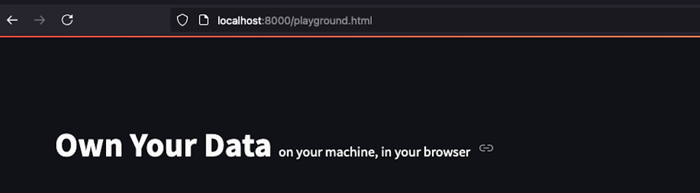
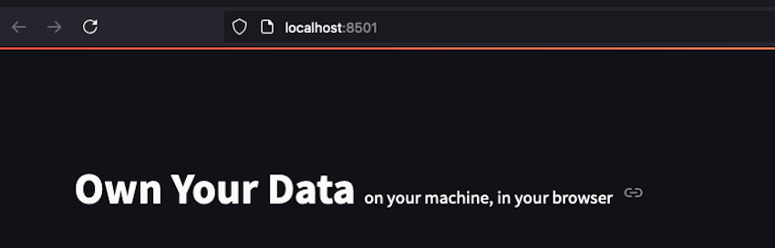
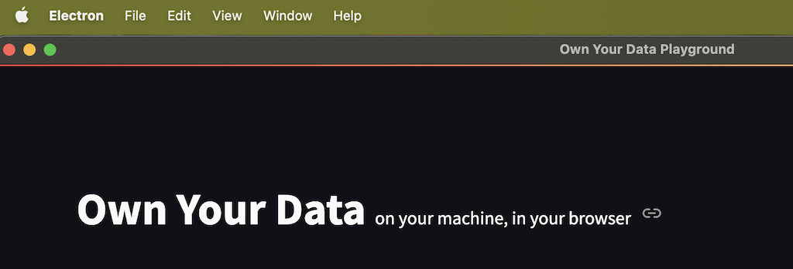

The source code of the application is available on Github, at: [https://github.com/acirtep/own-your-data](https://github.com/acirtep/own-your-data).
In order to run the application locally you need to download the code (or clone) to your local machine.

**When you run the application locally, a folder `own-your-data` is created automatically in your home directory.**

## Run the application as html
Make sure to have Python (greater than 3.12) installed on your local machine and, while inside the code directory,
run `python3 -m http.server`, which will spin up a server on localhost:8000.

The application will be available at: http://localhost:8000/playground.html .

Keep in mind, that when running the application as html, the database is saved in the temporary zone of the browser.

## Run the application as Streamlit

Make sure to have Python (greater than 3.12) and [poetry](https://python-poetry.org/) installed on your local machine.
From the code directory, first install the packages with poetry: `poetry install`.

Then run `make local_run` which will open the streamlit application in your browser (on localhost:8051).

In this mode, a database file (`own_your_data.db`) will be created in the `home/own-your-data` directory.
Running the application for a second time, it will use the previous created database, unless deleted manually.

## Run the application as desktop

Make sure to have npm installed on your local machine. From the code directory, run `npm install`, in order to install
the required packages.

Then `npm run dump`, in order to build the project and `npm run serve` which will open the desktop application.

The desktop application will use the database from the `home/own-your-data` directory.
