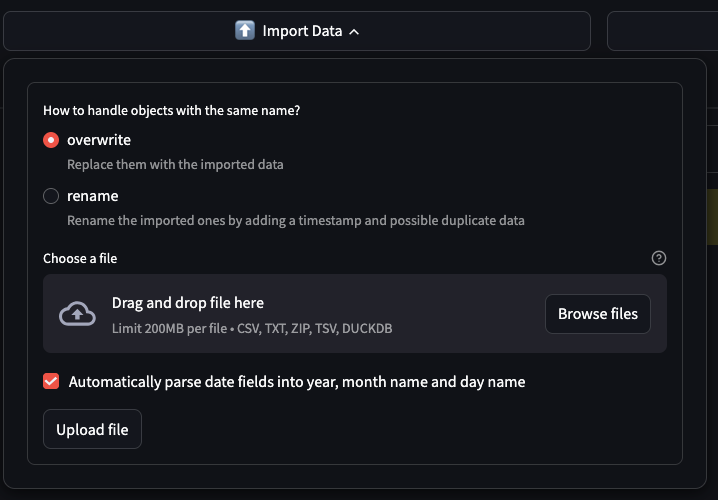
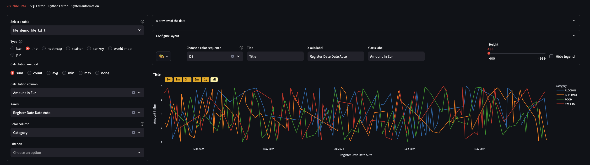
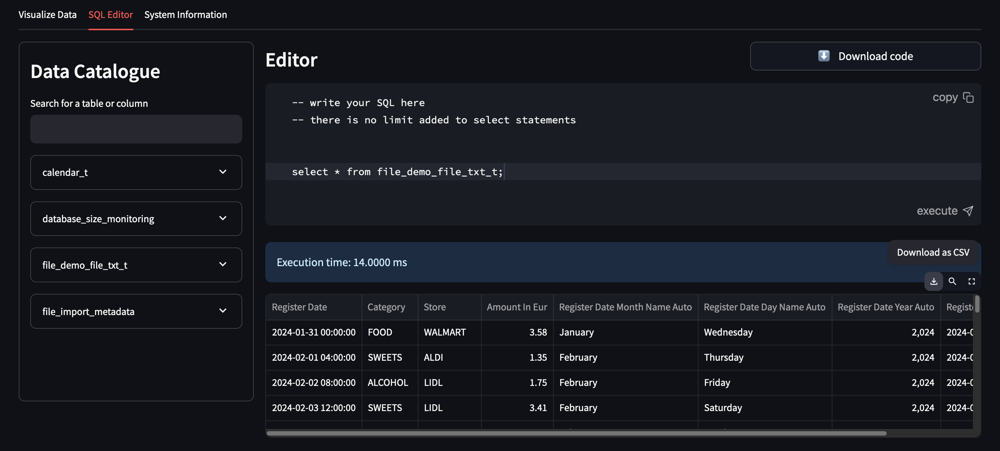

**Own Your Data**, *on your machine, in your browser*

## Import Data
Browse local files and upload a file, which contains data you are interested to analyze.

By parsing the dates automatically, for any column from the file which is recognized as date, the following columns
will be added:

1. the date itself, if the column is timestamp;
2. the name of the month (in English, January - December) of the date;
3. the name of the day (in English, Monday - Sunday) of the date;
4. the year of the date.

The uploaded data will be saved in a table prefixed with `file_` and suffixed with `_t`. For example, the demo file
`demo_file.txt` is loaded in the table named `file_demo_table_txt_t`.

## Visualize Data

Configure your chart by choosing the table to pick the data from, the plot type and the dimensions. Personalize it with
your color preference:

## Modify Data

Use the SQL editor to write SQL (DuckDB syntax) in order to view or modify the data. You can also download
the modified data:

